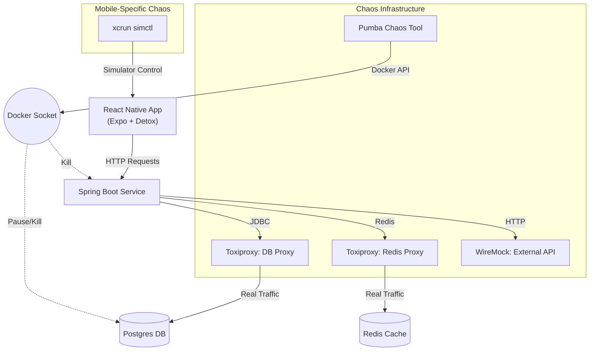

# Mobile Chaos Engineering Test Plan

## Overview
This plan defines chaos experiments for the **React Native mobile application** that connects to the **same Spring Boot microservice backend**. The mobile app mirrors the web frontend's functionality while adding mobile-specific resilience scenarios.

## Architecture



## Technology Stack

| Component | Technology |
|-----------|------------|
| **Mobile Framework** | React Native (Expo SDK 54) |
| **Language** | TypeScript |
| **Testing Framework** | Detox (E2E) + Jest |
| **iOS Simulator Control** | xcrun simctl |
| **Network Chaos** | Toxiproxy |
| **Container Chaos** | Docker / Pumba |
| **Reporting** | jest-html-reporters |
| **Backend** | Same Spring Boot MS as web |

## Testing Strategy — Triple-Layer Chaos

### Layer 1: App-Level Chaos (Detox Mock)
Fast, isolated tests that mock network conditions within the app.

| # | Scenario | Chaos Method | Validates |
|---|----------|-------------|-----------|
| 1 | High Latency | Unreachable server | Skeleton loaders display |
| 2 | API 500 Error | Unreachable server | No crash, error handling |
| 3 | Network Timeout | Unreachable server | UI remains stable |
| 4 | Offline Mode | `device.setURLBlacklist(['.*'])` | Content persistence |
| 5 | Empty Response | Unreachable server | Empty state handling |
| 6 | POST Failure | Unreachable server | Form data preservation |
| 7 | Status Cards | Unreachable server | Degraded state display |

### Layer 2: Full-Stack Integration (Toxiproxy)
Real chaos injected into the backend infrastructure.

| # | Scenario | Chaos Method | Validates |
|---|----------|-------------|-----------|
| 1 | 5s DB Latency | Toxiproxy latency toxic | Skeleton loaders + eventual load |
| 2 | DB Connection Cut | Toxiproxy bandwidth=0 | Error toast display |
| 3 | Redis Cache Cut | Toxiproxy bandwidth=0 | DB fallback works |
| 4 | MS Container Kill | `docker kill chaos-ms` | Connection refused handling |
| 5 | Backend Recovery | Inject then remove toxic | Auto-heal verification |

### Layer 3: Mobile-Specific Chaos (xcrun simctl)
Mobile-ONLY failure modes that don't exist in web.

| # | Scenario | Chaos Method | Validates |
|---|----------|-------------|-----------|
| 1 | Airplane Mode | `device.setURLBlacklist` | App survives toggle |
| 2 | Background/Foreground | `device.sendToHome` | State persistence |
| 3 | Memory Warning | `xcrun simctl notify_post` | No crash on OOM |
| 4 | Low Battery | `xcrun simctl status_bar` | UI stays functional |
| 5 | Slow 3G Network | Toxiproxy + simctl | Degraded performance |
| 6 | Force Termination | `xcrun simctl terminate` | Cold restart recovery |
| 7 | Orientation Change | `device.setOrientation` | No crash during load |
| 8 | Selective Net Block | `device.setURLBlacklist` | Partial degradation |

## How to Run

### Prerequisites
```bash
# 1. Xcode Command Line Tools
xcode-select --install

# 2. Boot an iOS simulator
xcrun simctl boot "iPhone 16 Pro"

# 3. Start the backend (if running Layer 2 or 3)
cd ../chaos-spring-ms && ./run.sh up
```

### Commands
```bash
# Build the iOS app for simulator
./run-mobile-chaos.sh build

# Run individual layers
./run-mobile-chaos.sh layer1    # App-Level Chaos (7 tests)
./run-mobile-chaos.sh layer2    # Integration Chaos (5 tests)
./run-mobile-chaos.sh layer3    # Mobile-Specific Chaos (8 tests)

# Run ALL layers
./run-mobile-chaos.sh all       # All 20 chaos scenarios

# List available simulators
./run-mobile-chaos.sh sim
```

### Manual Detox Commands
```bash
# Build
npx detox build --configuration ios.sim.debug

# Test specific layer
npx detox test --configuration ios.sim.debug --testPathPattern "layer1-app-chaos"

# Test all with HTML report
npx detox test --configuration ios.sim.debug
```

## Expected Results
| Layer | Scenarios | Expected Duration |
|-------|-----------|-------------------|
| Layer 1 (App-Level) | 7 | ~15s |
| Layer 2 (Integration) | 5 | ~90s |
| Layer 3 (Mobile-Only) | 8 | ~60s |
| **Total** | **20** | **~165s** |

## Mobile vs Web — Feature Parity Matrix

| Feature | Web (Playwright) | Mobile (Detox) |
|---------|------------------|----------------|
| Skeleton Loaders | ✅ `data-testid` | ✅ `testID` |
| Error Toast | ✅ `data-testid` | ✅ `testID` |
| Form Preservation | ✅ `page.inputValue` | ✅ `element.toHaveText` |
| Status Cards | ✅ `data-testid` | ✅ `testID` |
| Toxiproxy Integration | ✅ `fetch()` | ✅ `fetch()` |
| Docker Control | ✅ `execSync` | ✅ `execSync` |
| Offline Mode | ✅ `context.setOffline` | ✅ `device.setURLBlacklist` |
| **Mobile-Only** | | |
| Background/Foreground | ❌ N/A | ✅ `device.sendToHome` |
| Memory Warning | ❌ N/A | ✅ `xcrun simctl` |
| Battery State | ❌ N/A | ✅ `xcrun simctl` |
| Orientation Change | ❌ N/A | ✅ `device.setOrientation` |
| Force Termination | ❌ N/A | ✅ `xcrun simctl terminate` |
| Network Conditioning | ❌ N/A | ✅ `xcrun simctl status_bar` |

## Key Chaos Resilience Patterns Tested

1. **Skeleton Loaders**: Prevent blank screen during latency (mobile shimmer animation)
2. **Error Boundaries**: Catch and display friendly toasts (not crashes)
3. **Offline Handling**: URL blacklist simulates airplane mode
4. **Form Preservation**: Failed POSTs don't clear user input
5. **Pull-to-Refresh**: Recovery action available to users
6. **Background Survival**: App state persists across lifecycle changes
7. **Memory Resilience**: App doesn't crash on memory warnings
8. **Orientation Safety**: In-flight API calls survive rotation
