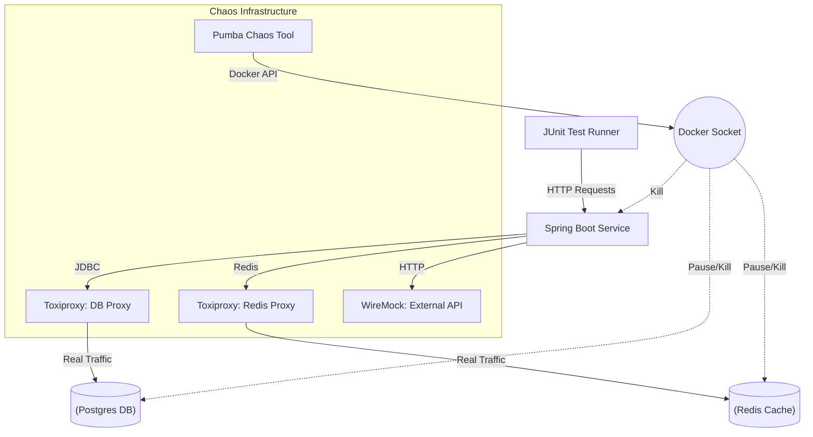
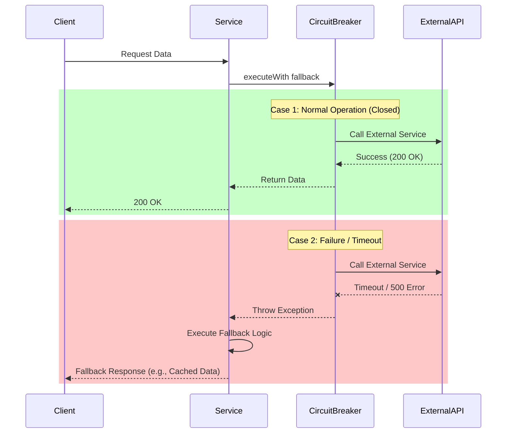
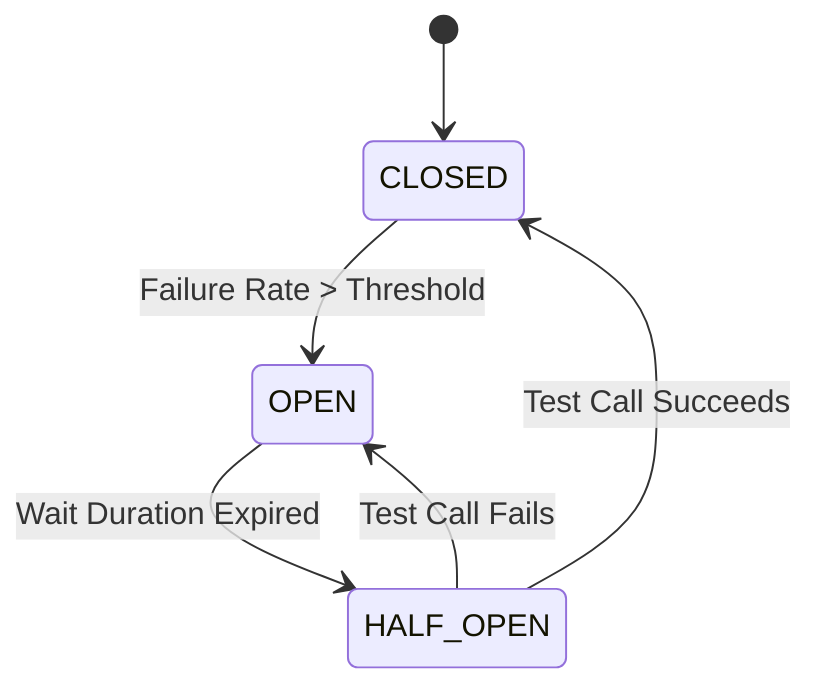

# Chaos Test Plan

## Overview
This plan defines the chaos experiments designed to validate the resilience and recovery capabilities of the `chaos-spring-ms` microservice. The goal is to ensure the system degrades gracefully under failure conditions and recovers automatically without manual intervention.

## Architecture & How It Works

The chaos testing environment simulates real-world failures by intercepting network traffic and manipulating container states.

### Component Interaction Diagram



### Explanation
1. **Service Under Test**: The `chaos-spring-ms` runs in a Docker container, fully isolated but accessible via mapped ports.
2. **Network Proxies (Toxiproxy)**: 
   - The service does NOT connect directly to Postgres or Redis. 
   - Instead, it connects to **Toxiproxy** ports. Toxiproxy forwards traffic to the real databases but allows us to inject **latency** (slow responses) or **bandwidth limits** (timeouts/connection cuts) dynamically during tests.
3. **External API Mocking (WireMock)**: 
   - External dependencies are mocked using **WireMock**.
   - Tests configure WireMock to return **delayed responses** (triggering timeouts) or **error codes** (500, 503, 400) to verify circuit breaker behavior.
4. **Container Chaos (Pumba)**:
   - **Pumba** connects to the Docker socket.
   - It can **pause** containers (simulating a freeze), **kill** containers (simulating a crash), or **stop** them.
   - We use this to verify that the application reconnects to the DB/Redis once they come back online.

---

## How to Run

Running chaos tests is automated via the `run.sh` script in the root directory.

### 1. Start the Environment
Before running tests, you must bring up the entire stack (Infrastructure + Microservice).
```bash
./run.sh up
```
*This command allocates ports, starts Docker containers, waits for health checks, and bootstraps Toxiproxy.*

### 2. Execute Chaos Tests
Run the automated JUnit5 test suite which triggers the experiments defined below.
```bash
./run.sh chaos
```
*This command restarts the microservice to ensure a clean state and then executes `mvn test` from the `tests/` directory.*

### 3. Monitoring & Debugging
- **Logs**: To watch the service logs during an experiment:
  ```bash
  ./run.sh logs
  ```
- **Toxiproxy**: To inspect the current state of a proxy (e.g., `db_proxy`):
  ```bash
  curl http://localhost:$TOXIPROXY_PORT/proxies/db_proxy
  ```

### 4. Cleanup
Stop and remove all containers when finished.
```bash
./run.sh down
```

---

## Scenarios

### Network & Dependency Failures (Toxiproxy)

#### E1: Database Latency
- **Type**: Network Toxic
- **Action**: Inject 1000ms latency into `db_proxy`.
- **Goal**: Verify service handles slow database connections without hanging. Connection pool (HikariCP) should manage connections, and the request should complete or fail within a reasonable bound.

#### E2: Database Timeout (Connectivity Loss)
- **Type**: Network Toxic
- **Action**: Set bandwidth to 0 bps on `db_proxy` (simulating a cut cable).
- **Goal**: Verify service returns a controlled error (503/500) quickly, respecting the connection timeout (e.g., 2s), and does not block indefinitely.

#### E3: Redis Latency
- **Type**: Network Toxic
- **Action**: Inject 500ms latency into `redis_proxy`.
- **Goal**: Verify that cache retrieval is still functional but slower. The service should not fail completely; it might just be slower.

#### E4: Redis Availability Loss
- **Type**: Network Toxic
- **Action**: Set bandwidth to 0 bps on `redis_proxy`.
- **Goal**: Verify service availability. If Redis is down, the service should either fallback to the DB (cache miss behavior) or return a clean error. It should NOT hang.

### External API Failures (WireMock & Resilience4j)

#### E5: External API Latency (Circuit Breaker)
- **Type**: Application Mock
- **Action**: WireMock delays response by 3000ms.
- **Goal**: Verify that **Resilience4j TimeLimiter** times out the request and the **CircuitBreaker** opens if the failure rate threshold is met. Fallback response (e.g., "Service Unavailable" or cached data) should be returned.

#### E6: External API Failure (500)
- **Type**: Application Mock
- **Action**: WireMock returns HTTP 500.
- **Goal**: Verify that the service handles upstream errors gracefully, triggering fallback logic without propagating stack traces to the client.

#### E7: External API Malformed Response
- **Type**: Application Mock
- **Action**: WireMock returns garbage body.
- **Goal**: Verify that JSON parsing errors are caught and handled as internal errors or fallbacks, not crashing the request processing.

### Infrastructure Failures (Pumba)

#### E8: Postgres Container Pause
- **Type**: Container Chaos
- **Action**: `pumba pause --duration 10s chaos-postgres`
- **Goal**: Simulate valid socket connection but unresponsive server (freeze). Verify requests fail fast (after timeout) and the system recovers **immediately** after the database unpauses.

#### E9: Redis Container Restart
- **Type**: Container Chaos
- **Action**: `pumba kill chaos-redis` (Docker auto-restarts it).
- **Goal**: Verify **automatic reconnection**. The Spring Boot Redis client (Lettuce/Jedis) should seamlessly reconnect to the new Redis instance without requiring a service restart.

#### E10: Microservice Container Kill
- **Type**: Container Chaos
- **Action**: `pumba kill chaos-ms`.
- **Goal**: Verify that the Docker restart policy (`restart: always` or `unless-stopped`) brings the service back online. Once up, it should successfully reconnect to all dependencies (DB, Redis) and become healthy again.

---

## Visualizing Failure

### Sequence Diagram: Circuit Breaker Flow
This diagram illustrates how the application handles external API failures using the Circuit Breaker pattern.



### State Diagram: Circuit Breaker States
This diagram shows the states a Circuit Breaker transitions through based on failure rates.


